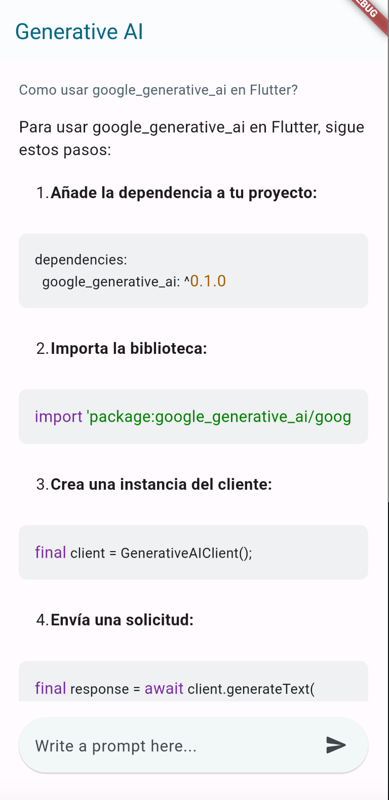

## Flutter App con Generative AI: Ejemplo Básico


**Introducción**

En este tutorial, demostraremos cómo utilizar la biblioteca `generative_ai` en una aplicación Flutter para generar texto a partir de un prompt.

**Requisitos previos**

* Flutter SDK instalado
* Dart SDK instalado
* Conocimiento básico de Flutter

**Pasos a seguir**

1. **Crear un nuevo proyecto Flutter**

   ```
   flutter create my_generative_ai_app
   ```

2. **Agregar las dependencias necesarias**

   Abra el archivo `pubspec.yaml` y agregue las siguientes dependencias:

   ```
   dependencies:
     flutter:
       sdk: flutter
     google_generative_ai: ^0.2.0
   ```

3. **Crear la interfaz de usuario**

   Cree una interfaz de usuario simple con un campo de texto para ingresar el prompt y un botón para generar el texto.

   ```
    class _Body extends StatefulWidget {
    @override
    State<_Body> createState() => _BodyState();
    }

    class _BodyState extends State<_Body> {
    final _scrollController = ScrollController();
    @override
    Widget build(BuildContext context) {
        return BlocConsumer<GenerativeAIBloc, GenerativeAIState>(
        listenWhen: (previous, current) => current is PromptLoadedState,
        listener: (context, state) {
            if (state is PromptLoadedState) {
            if (_scrollController.hasClients) {
                WidgetsBinding.instance.addPostFrameCallback(
                (_) => _scrollController.animateTo(
                    _scrollController.position.maxScrollExtent,
                    duration: const Duration(
                    milliseconds: 1000,
                    ),
                    curve: Curves.easeOutCirc,
                ),
                );
            }
            }
        },
        builder: (context, state) {
            return Padding(
            padding: const EdgeInsets.all(DsSpace.lg).copyWith(bottom: 0),
            child: Column(
                children: [
                Expanded(
                    child: Column(
                    crossAxisAlignment: CrossAxisAlignment.start,
                    children: [
                        Text(
                        state.prompt,
                        style: TextStyle(
                            color: Theme.of(context).colorScheme.secondary,
                        ),
                        ),
                        DsVerticalSpace.sm,
                        AIGeneratorTextWidget(
                        scrollController: _scrollController,
                        generateContentResponse: state.generateContentResponse,
                        ),
                        DsVerticalSpace.md,
                        if (state is ShowLoading || state.isPromptLoading) ...[
                        const _LoadingWidget(),
                        DsVerticalSpace.md,
                        ],
                    ],
                    ),
                ),
                BoxSearch(),
                DsVerticalSpace.xxl,
                ],
            ),
            );
        },
        );
    }
    }
   ```

5. **Utilizar la biblioteca `google_generative_ai`**

   Para generar texto, use la función `generativeAI.generateContentStream([content])`. Esta función toma un prompt como entrada y devuelve un `GenerativeModelResponse` que contiene el texto generado.

6. **Ejecutar la aplicación**

   Ejecute la aplicación con el comando `flutter run`.

**Ejemplo de uso**

1. Ingrese un prompt en el campo de texto.
2. Haga clic en el botón enviar para generar texto.
3. La aplicación mostrará el texto generado en la parte top de la pantalla.

**Recursos adicionales**

* Documentación de la biblioteca `google_generative_ai`: [https://ai.google.dev/tutorials/dart_quickstart?hl=es-419]
* Tutoriales sobre Flutter: [https://flutter.dev/docs/cookbook](https://flutter.dev/docs/cookbook)

**Conclusión**

En este tutorial, demostramos cómo utilizar la biblioteca `google_generative_ai` en una aplicación Flutter para generar texto a partir de un prompt. Este es un ejemplo básico, pero puede usarse como base para crear aplicaciones más complejas que utilicen la tecnología Generative AI.
